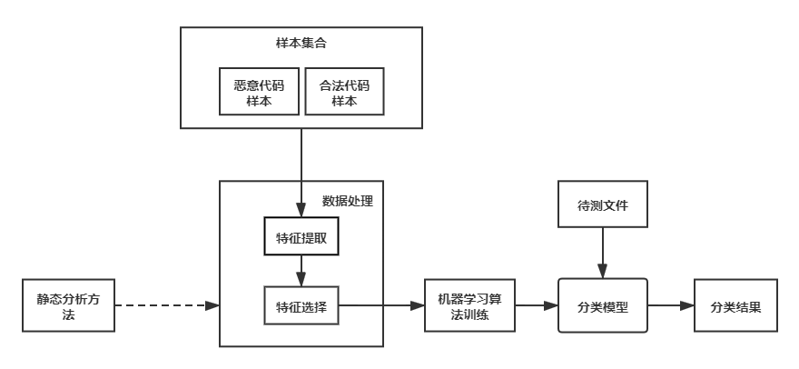
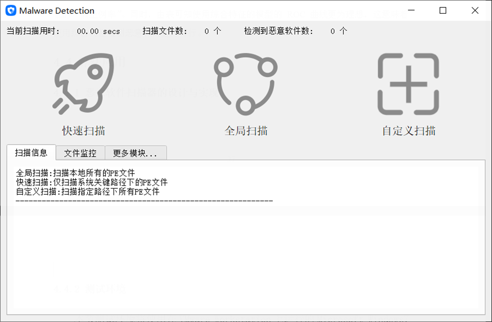

# Malware_Detection
通过对恶意文件进行分析与采集数据，基于机器学习算法得到病毒识别模型

- 首先对样本集合进行脱壳预处理，避免影响实验结果

- 其次采用静态分析方法，提取有效特征
- 然后根据不同特征类型，使用不同方法将特征向量化作为机器学习算法的输入
- 最后使用分类模型对文件进行预测，得到分类结果

## 静态分析方法

1. 汇编操作码提取

   - 利用 IDA Pro 自动反编译原文件（预处理阶段已进行脱壳操作），获得恶意代码的汇编程序
   - N-gram、Doc2vec 算法提取Opcode特征

2. 可执行文件结构特征提取

   - 根据可执行文件的特性，恶意代码存在不同于合法代码的地方，提取此类特征作为算法的输入

3. 二进制文件的静态特征提取

   使用的 9 组静态特征分别是：

   - 字节-熵对统计特征
   - PE头IAT特征
   - 可打印字符
   - PE元信息
   - 文件一般信息
   - 导出函数表EAT特征
   - 节信息
   - 数据目录
   - 字节直方图

## 实验结果

- 分别使用 N-gram 算法和 Doc2vec 算法提取数据集中恶意样本的操作码特征，通过解析二进制文件提取综合静态特征

- 然后将这三种特征应用到七种不同类型的机器学习模型进行训练，这七种机器学习模型包括随机森林、支持向量机、逻辑回归、K 近邻、轻量的梯度提升分类器、朴素贝叶斯以及决策树

## 基于识别模型的恶意代码识别工具

- 根据实验结果选择 LightGBM 分类器作为学习模型，并使用完整的数据集进行训练得到识别模型，同时对超参数进行优化，为模型选择一组最优超参数，以提高模型的性能和效果
- 最终采用 PYQT5图形化编程技术 设计与实现一个简易的基于机器学习的恶意代码检测工具

- 仅用于成果展示，没有实际应用价值 Orz，特点是**多线程扫描**，**文件监控**以及**特征库自动更新**，经过测试杀毒效果还行，但是对于加壳免杀的文件，在数据不够大的情况下还是无法准确识别到

- 使用的实验数据大部分来自Github社区用户分享以及国外各大恶意样本公开平台，使用的样本集大小为13GB(包含10868个样本文件)

  
